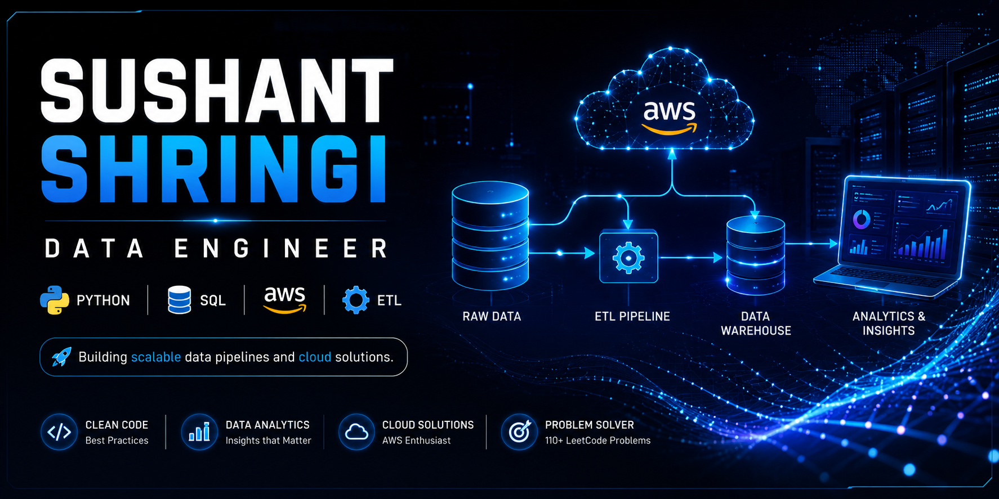

<div align="center">



<br>

[](https://git.io/typing-svg)

<br>

<a href="https://github.com/Sushant-shringi">

</a>

<a href="https://github.com/Sushant-shringi">

</a>


<br><br>

<a href="https://linkedin.com/in/sushant-shringi">

</a>

<a href="mailto:YOUR_EMAIL@gmail.com">

</a>

<a href="https://leetcode.com/Sushant-shringi">

</a>

<a href="https://github.com/Sushant-shringi">

</a>

</div>

---

# 💫 About Me


I'm an **Aspiring Data Engineer** passionate about building scalable **ETL pipelines**, automating workflows, and developing cloud-native solutions using **Python**, **SQL**, and **AWS**.

I enjoy transforming raw data into meaningful insights while continuously learning modern data engineering technologies.

### 🚀 Currently Working On

- ☁️ AWS Serverless Projects
- 📊 ETL Pipelines
- 🐍 Python Automation
- 🗄️ SQL Problem Solving
- 📈 Data Engineering Projects

### 🎯 2026 Goals

- ✅ 250+ LeetCode Problems
- ✅ Master AWS Data Services
- ✅ Learn Apache Spark
- ✅ Learn Apache Airflow
- ✅ Crack a Data Engineering Role

---
# 💻 Tech Arsenal

<div align="center">

## 👨‍💻 Languages

<p>


</p>

---

## ☁️ Cloud & Data Engineering

<p>


</p>

---

## 📊 Data Analytics

<p>


</p>

---

## ⚙️ Tools & DevOps

<p>


</p>

---

## 📚 Currently Learning

<p>


</p>

</div>

---

# 📌 Core Competencies

| 💡 Domain | 🚀 Skills |
|-----------|-----------|
| Programming | Python, SQL, Bash |
| Cloud | AWS Lambda, Amazon S3, DynamoDB, IAM |
| Data Engineering | ETL Pipelines, Data Validation, Data Transformation |
| Data Analysis | Pandas, NumPy, Matplotlib |
| Version Control | Git, GitHub |
| Operating System | Linux |
| Containerization | Docker |
| Problem Solving | Data Structures & Algorithms |

---

# 📈 Learning Progress

```text
🐍 Python                 ████████████████████ 95%

🗄️ SQL                    ██████████████████░ 90%

☁️ AWS                    ███████████████░░░ 75%

⚡ ETL Pipelines          ███████████████░░░ 80%

📊 Data Analysis          ████████████████░░ 82%

🐳 Docker                 ████████████░░░░░░ 60%

⚙️ Apache Spark          ██████░░░░░░░░░░░░ 30%

🌪️ Apache Airflow        ████░░░░░░░░░░░░░░ 20%
```

---

# 🚀 Featured Projects

<div align="center">

> **Production-inspired projects showcasing my journey in Data Engineering, Cloud Computing, and Python Automation.**

</div>

---

<table>

<tr>

<td width="50%">

## ⚡ Serverless ETL Pipeline

Production-inspired ETL pipeline built using **AWS Lambda**, **Amazon S3**, **DynamoDB**, and **Python**.

### ✨ Highlights

- Event-Driven Architecture
- JSON & CSV Processing
- Data Validation
- Peak Hour Detection
- DynamoDB Loader
- Modular ETL Design

**Tech Stack**


⭐ **Repository:** *(Add Link)*

</td>

<td width="50%">

## 🌍 Earthquake Data Pipeline

Cloud-based ETL pipeline that extracts earthquake data using public APIs and stores processed datasets in AWS.

### ✨ Highlights

- API Integration
- Data Cleaning
- AWS S3 Storage
- ETL Workflow
- Python Automation

**Tech Stack**


⭐ **Repository:** *(Add Link)*

</td>

</tr>

<tr>

<td width="50%">

## ☁️ API → Amazon S3

Python automation project for fetching API data and storing it securely in Amazon S3.

### ✨ Highlights

- REST API
- JSON Processing
- Boto3
- S3 Upload
- Error Handling

**Tech Stack**


⭐ **Repository:** *(Add Link)*

</td>

<td width="50%">

## 🗄 SQL Practice Repository

A growing collection of SQL queries covering joins, aggregations, window functions, CTEs, and analytical SQL problems.

### ✨ Highlights

- Joins
- Window Functions
- Aggregate Queries
- Interview Questions
- Database Practice

**Tech Stack**


⭐ **Repository:** *(Add Link)*

</td>

</tr>

<tr>

<td width="50%">

## 📊 Data Analysis Projects

Real-world data analysis projects using Python and data visualization libraries.

### ✨ Highlights

- Data Cleaning
- EDA
- Visualization
- Pandas
- NumPy

**Tech Stack**


⭐ **Repository:** *(Add Link)*

</td>

<td width="50%">

## 💻 LeetCode Solutions

A repository containing clean and optimized solutions for Data Structures & Algorithms problems.

### ✨ Highlights

- 110+ Problems
- C++
- Python
- Arrays
- Strings
- Dynamic Programming

**Tech Stack**


⭐ **Repository:** *(Add Link)*

</td>

</tr>

</table>

---

# 🏆 Project Highlights

| 📌 Category | 🚀 Projects |
|-------------|------------|
| ☁️ Cloud | AWS Lambda, Amazon S3, DynamoDB |
| 📊 Data Engineering | ETL Pipelines, Automation |
| 🐍 Python | API Integration, Data Processing |
| 📈 Analytics | Data Cleaning & Visualization |
| 💻 SQL | Advanced SQL Practice |
| 🧩 DSA | 110+ LeetCode Solutions |

---

# 📊 GitHub Analytics

<div align="center">


<br><br>


</div>

---

# 🏆 GitHub Achievements

<div align="center">

| 🏅 Achievement | Status |
|:-------------|:------:|
| 🧩 LeetCode Problems Solved | **110+** |
| 🐍 Python Projects | ✅ |
| ☁️ AWS Cloud Projects | ✅ |
| 📊 ETL Pipelines | ✅ |
| 🗄 SQL Practice | ✅ |
| 🌍 Open Source Journey | 🚀 Growing |

</div>

---

# ☁️ AWS Learning Journey

```text
AWS S3             ████████████████████ 100%

AWS Lambda         ██████████████████░░ 90%

AWS IAM            ████████████████░░░░ 80%

Amazon DynamoDB    ███████████████░░░░░ 75%

AWS Glue           ██████████░░░░░░░░░░ 50%

Amazon Athena      ███████░░░░░░░░░░░░░ 35%

Amazon Redshift    ████░░░░░░░░░░░░░░░░ 20%

Apache Spark       ██████░░░░░░░░░░░░░░ 30%

Apache Airflow     ████░░░░░░░░░░░░░░░░ 20%
```

---

# 🎯 2026 Goals

- ✅ Solve **250+ LeetCode** Problems
- ☁️ Build **10+ AWS Projects**
- 🚀 Master ETL Pipeline Design
- 📊 Learn Apache Spark
- 🌪 Learn Apache Airflow
- 📦 Learn Docker & Kubernetes
- 🏗 Build End-to-End Data Engineering Projects
- 💼 Land a Data Engineering Role

---

# 📈 Contribution Graph

<div align="center">


</div>

---

# 🐍 Contribution Snake

<div align="center">

> ⚠️ Enable GitHub Actions in your profile repository before using this.


</div>

---

# 🧠 LeetCode Progress

<div align="center">


</div>

---

# 🤝 Let's Connect

<div align="center">

### 💬 Always Open To


<br><br>

<a href="https://linkedin.com/in/sushant-shringi">

</a>

<a href="mailto:YOUR_EMAIL@gmail.com">

</a>

<a href="https://github.com/Sushant-shringi">

</a>

<a href="https://leetcode.com/Sushant-shringi">

</a>

</div>

---

# 💼 Currently Looking For

- 🚀 Data Engineering Internship
- ☁️ AWS Cloud Projects
- 📊 ETL Development
- 🐍 Python Automation
- 🤝 Open Source Contributions

---

# 📚 Currently Learning

- Apache Spark
- Apache Airflow
- Terraform
- Kafka
- Snowflake
- dbt

---

# 💡 Fun Fact

```text
while(!success)
{
    learn();
    build();
    improve();
}
```

---

# ☕ Favorite Quote

> **"Small improvements every day lead to remarkable results."**

---

<div align="center">

## ⭐ If you like my work...

Give a ⭐ to my repositories.

It motivates me to build more awesome projects.

</div>

---

<div align="center">


### 🚀 Thanks for visiting my profile!

**Happy Coding ❤️**


</div>
